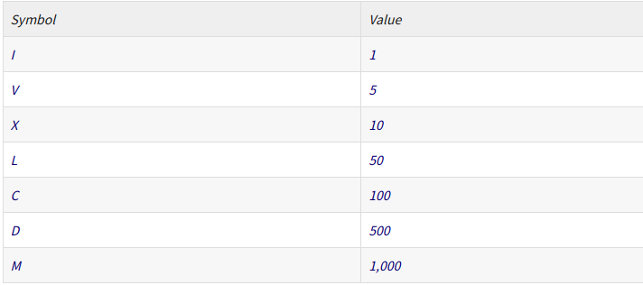

# Merchant's Guideto the Galaxy

```
You decided to give up on earth after the latest financialcollapse left 99.99% of the earth's population with 0.01% of the wealth.Luckily, with the scant sum of money that is left in your account, you are ableto afford to rent a spaceship, leave earth, and fly all over the galaxy to sellcommon metals and dirt (which apparently is worth a lot).


Buying and selling over the galaxy requires you to convert numbersand units, and you decided to write a program to help you.


The numbers used for intergalactic transactions follows similarconvention to the roman numerals and you have painstakingly collected theappropriate translation between them.


Roman numerals are based on seven symbols:


  

Numbers are formed by combining symbols together and adding thevalues. For example, MMVI is 1000 + 1000 + 5 + 1 = 2006. Generally, symbols areplaced in order of value, starting with the largest values. When smaller valuesprecede larger values, the smaller values are subtracted from the largervalues, and the result is added to the total. For example MCMXLIV = 1000 +(1000 − 100) + (50 − 10) + (5 − 1) = 1944.

 

    The symbols "I", "X", "C", and "M" can be repeated three times in succession, but no more. (They may appear four times if the third and fourth are separated by a smaller value, such as XXXIX.) "D", "L", and "V" can never be repeated.
    "I" can be subtracted from "V" and "X" only. "X" can be subtracted from "L" and "C" only. "C" can be subtracted from "D" and "M" only. "V", "L", and "D" can never be subtracted.
    Only one small-value symbol may be subtracted from any large-value symbol.
    A number written in [16]Arabic numerals can be broken into digits. For example, 1903 is composed of 1, 9, 0, and 3. To write the Roman numeral, each of the non-zero digits should be treated separately. Inthe above example, 1,000 = M, 900 = CM, and 3 = III. Therefore, 1903 = MCMIII.

(Source: Wikipedia ( [17]http://en.wikipedia.org/wiki/Roman_numerals)

 

Input to your program consists of lines of text detailing yournotes on the conversion between intergalactic units and roman numerals.


You are expected to handle invalid queries appropriately.


Test input:

glob is I

prok is V

pish is X

tegj is L

glob glob Silver is 34 Credits

glob prok Gold is 57800 Credits

pish pish Iron is 3910 Credits

how much is pish tegj glob glob ?

how many Credits is glob prok Silver ?

how many Credits is glob prok Gold ?

how many Credits is glob prok Iron ?

how much wood could a woodchuck chuck if a woodchuck could chuckwood ?

 

Test Output:

pish tegj glob glob is 42

glob prok Silver is 68 Credits

glob prok Gold is 57800 Credits

glob prok Iron is 782 Credits

I have no idea what you are talking about
```

## 中文翻译  

```
在最近的金融崩溃让地球上99.99％的人口拥有0.01％的财富之后，您决定放弃地球。幸运的是，由于账户中剩余的钱很少，您有能力租用一艘太空船，离开地球，然后飞越整个银河以出售常见的金属和尘土（显然很有价值）。


在银河系上进行买卖需要您转换数字和单位，因此您决定编写程序来帮助您。


用于星际交易的数字遵循与罗马数字相似的约定，因此您辛苦地收集了它们之间的适当翻译。


罗马数字基于七个符号：


数字是通过将符号组合在一起并加上值而形成的。例如，MMVI为1000 + 1000 + 5 + 1 =2006。通常，将符号按值的顺序放置，从最大值开始。当较小的值优先于较大的值时，将从较大的值中减去较小的值，然后将结果相加。例如MCMXLIV = 1000 +（1000 − 100）+（50 − 10）+（5 − 1）= 1944。

 

    符号“ I”，“ X”，“ C”和“ M”可以连续重复三次，但不能重复。 （如果第三个和第四个之间用较小的值隔开，例如XXXIX，它们可能会出现四次。）“ D”，“ L”和“ V”永远不能重复。
    只能从“ V”和“ X”中减去“ I”。只能从“ L”和“ C”中减去“ X”。只能从“ D”和“ M”中减去“ C”。绝对不能减去“ V”，“ L”和“ D”。
    任何大数值符号都只能减去一个小数值符号。
    用[16]阿拉伯数字写成的数字可以分成数字。例如，1903由1、9、0和3组成。要写罗马数字，每个非零数字应分开对待。在上面的示例中，1,000 = M，900 = CM和3 = III。因此，1903 = MCMIII。

（来源：维基百科（[17] http://en.wikipedia.org/wiki/Roman_numerals）

程序的输入由多行文字组成，详细说明了星际单位和罗马数字之间转换的注释。

您应该适当地处理无效查询。


测试输入：

我是全球

prok是V

盘是X

tegj是L

glob glob银是34点数

glob prok金是57800积分

pish pish铁为3910积分

pish tegj glob glob是多少？

银币是多少学分？

多少学分？

glob prok Iron有多少学分？

土拨鼠能砍多少木材？

 

测试输出：

pish tegj glob glob是42

glob prok Silver是68点数

glob prok金是57800积分

glob prok铁为782积分

我不知道你在说什么
```